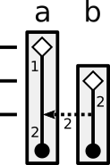
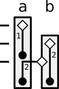

# Instance Identity in C++ and Rust

*Author: Johnathan Van Why*

## Overview

C++ and Rust have subtly different concepts of an "instance" of a type and how
basic operations affect the identities of instances. This document highlights
those differences, and is intended to be a tool for programmers transitioning
between the languages.

I primarily discuss assignment operations because it leads to the clearest
examples, but the same conceptual differences exist elsewhere in the languages
(such as argument assignment during function calls).

## Two Interpretations

To demonstrate this difference, consider the following pseudocode program:

```
MyType a = 1;
MyType b = 2;
a = b;      // assignment, not comparison
```

There are multiple possible interpretations of line 3 of the above program. Here
are two:

1.  `a` is modified to equal the value of `b`
1.  `a` is replaced by the value of `b`

These interpretations may seem equivalent, but they are not. If `MyType` is not
trivially copyable, each interpretation corresponds to different semantics for
the assignment operation. C++ and Rust interpret this operation differently.

### C++

C++'s assignment semantics differ depending on the properties of `MyType`.
However, the most interesting case is when `MyType` is a class type with
by-reference assignment operators (as opposed to a by-value assignment operator
overload). Some other examples are below, but for now let's assume that `MyType`
is a class type that does not have a by-value assignment operator overload.

In C++, `a` is modified to equal the value of `b`. Using C++'s interpretation,
there are two instances ("objects" in C++ parlance) of type MyType in the above
program: one named `a` and one named `b`. Line 3 mutates instance `a` but does
not create or destroy any instances (`a` and `b` are destroyed at the end of the
scope they are embedded in).

Here is a representative diagram of this interpretation. The boxes indicate the
locations of the underlying storage (`a` and `b`). Solid lines indicate instance
lifetime (diamonds are instance creation and dots are instance destruction),
while the dotted lines represent data transmitted between instances. The numbers
represent values:



As mentioned above, here are some other assignment semantics that occur in C++:

*  If `MyType` is not a class type (e.g. `MyType` is `int`), the assignment will
   convert `b` from a dlvalue to a prvalue, copy-constructing it (creating a
   third instance of `MyType`), then assign the third instance's value to `a`.
   This is not particularly interesting because these constructions cannot be
   observed (the observable semantics do not differ from a direct assignment).
*  If `MyType`'s assignment operator takes the right hand side by value (which
   requires a manual overload), a temporary third instance of `MyType` is
   created by copy-constructing `b`, then the third instance is used to assign
   into `a`.

### Rust

In Rust, `a` is replaced by the value of `b`. Using Rust's interpretation, if
`MyType` is `Copy`, there are three instances of type `MyType` in the above
program. Each instance is created on a separate line:

1.  The first instance has value 1, is created on line 1, and is destroyed on
    line 3.
1.  The second instance has value 2, is created on line 2, and is destroyed at
    the end of the scope.
1.  The third instance has value 2 (it is a copy of value 2), and is destroyed
    at the end of the scope.

Here's a representative diagram of this interpretation, using the same markers
as the C++ diagram:



## Observable Effects (Demonstration)

Of course, a philosophical difference in interpretation is not important if it
does not affect program behavior. Here are complete programs demonstrating the
differences. The differences will be demonstrated using assignment, but they
impact function calls as well (affecting how function parameters and arguments
interact).

### C++

In C++, the creation and destruction of instances may be observed through
constructor and destructor calls. Assignment operator calls are used to move
data between instances, but are not related to instance lifetime.

The following program:

```c++
#include <iostream>
#include <utility>

using std::cout;
using std::move;

struct MyType {
  // value_ == 0 in the moved-from state
  int value_;

  // Constructors
  MyType(int value) : value_(value) {
    cout << "Constructing with value " << value_ << "\n";
  }
  MyType(const MyType& rhs) : value_(rhs.value_) {
    cout << "Copy constructing with value " << value_ << "\n";
  }
  MyType(MyType&& rhs) : value_(rhs.value_) {
    cout << "Move constructing with value " << value_ << "\n";
    rhs.value_ = 0;
  }

  // Assignment operators
  MyType& operator=(const MyType& rhs) {
    cout << "Copying value " << rhs.value_ << " over value " << value_ << "\n";
    value_ = rhs.value_;
    return *this;
  }
  MyType& operator=(MyType&& rhs) {
    cout << "Moving value " << rhs.value_ << " over value " << value_ << "\n";
    value_ = rhs.value_;
    rhs.value_ = 0;
    return *this;
  }

  // Destructor
  ~MyType() {
    if (value_ != 0) {
      cout << "Destructing value " << value_ << "\n";
    } else {
      cout << "Destructing empty value\n";
    }
  }
};

int main() {
  {
    cout << "MyType a = 1;\n";    MyType a = 1;
    cout << "\nMyType b = 2;\n";  MyType b = 2;
    cout << "\na = b;\n";         a = b;

    cout << "\nEnd of scope:\n";
  }
  {
    cout << "\nMyType a = 1;\n";  MyType a = 1;
    cout << "\nMyType b = 2;\n";  MyType b = 2;
    cout << "\na = move(b);\n";   a = move(b);

    cout << "\nEnd of scope:\n";
  }
}
```

Outputs:

```
MyType a = 1;
Constructing with value 1

MyType b = 2;
Constructing with value 2

a = b;
Copying value 2 over value 1

End of scope:
Destructing value 2
Destructing value 2

MyType a = 1;
Constructing with value 1

MyType b = 2;
Constructing with value 2

a = move(b);
Moving value 2 over value 1

End of scope:
Destructing empty value
Destructing value 2
```

### Rust

In Rust, we can observe instance construction through a factory function,
cloning using the
[`Clone`](https://doc.rust-lang.org/std/clone/trait.Clone.html) trait, and the
destruction of
non-[`Copy`](https://doc.rust-lang.org/std/marker/trait.Copy.html) types using
the [`Drop`](https://doc.rust-lang.org/std/ops/trait.Drop.html) trait. (Note for
C++ users: Rust's `Clone` is a different concept from the virtual `Clone` method
used to make a base class copyable in C++.) We cannot observe assignment (moves
or copies) in Rust (Rust gives moves and copies memcopy semantics with no
override option).

The following program:

```rust
struct MyType {
  value: i32
}

impl MyType {
  pub fn new(value: i32) -> MyType {
    println!("Constructing with value {}", value);
    MyType { value: value }
  }
}

impl Clone for MyType {
  fn clone(&self) -> Self {
    println!("Cloning with value {}", self.value);
    MyType { value: self.value }
  }
}

impl Drop for MyType {
  fn drop(&mut self) {
    println!("Dropping value {}", self.value);
  }
}

fn main() {
  {
    println!(  "let mut a = MyType::new(1);");  let mut a = MyType::new(1);
    println!("\nlet mut b = MyType::new(2);");  let mut b = MyType::new(2);
    println!("\na = b.clone();");               a = b.clone();
    println!("\nEnd of scope:");
  }
  {
    println!("\nlet mut a = MyType::new(1);");  let mut a = MyType::new(1);
    println!("\nlet mut b = MyType::new(2);");  let mut b = MyType::new(2);
    println!("\na = b;");                       a = b;
    println!("\nEnd of scope:");
  }
}
```

Outputs:

```
let mut a = MyType::new(1);
Constructing with value 1

let mut b = MyType::new(2);
Constructing with value 2

a = b.clone();
Cloning with value 2
Dropping value 1

End of scope:
Dropping value 2
Dropping value 2

let mut a = MyType::new(1);
Constructing with value 1

let mut b = MyType::new(2);
Constructing with value 2

a = b;
Dropping value 1

End of scope:
Dropping value 2
```

## Thoughts on Abstraction

To a certain extent, these interpretations make sense at different levels of
abstraction.

In C++, methods operate at the level of an "object", which corresponds with the
storage backing the instance of a type. As a result, behaviors such as
assignment (or construction that occurs during a function call) are seen as an
interaction between separate type instances. In general, individual objects are
not moved between underlying storage because objects are directly tied to their
storage. Also, note that return value optimization in C++ does not remove copy
construction between two distinct objects, it was implemented by identifying the
returned-from and the returned-to variables as the same object.

In Rust, variable names represent storage for values, but Rust's notion of an
instance is a bit higher level. An instance of a type can move freely between
separate storage locations, and a moved-from storage location does not contain
an instance of a type at all.

These semantic differences result in C++ and Rust's different moved-from
variable semantics. C++ allows you to manipulate a moved-from variable because
that variable still contains a valid instance of its type, while Rust does not
allow you to touch a moved-from variable (except for replacement) because the
moved-from variable does not contain a valid instance of a type.

<a rel="license" href="http://creativecommons.org/licenses/by-nc-sa/4.0/"></a><br />This work is licensed under a <a rel="license" href="http://creativecommons.org/licenses/by-nc-sa/4.0/">Creative Commons Attribution-NonCommercial-ShareAlike 4.0 International License</a>.
